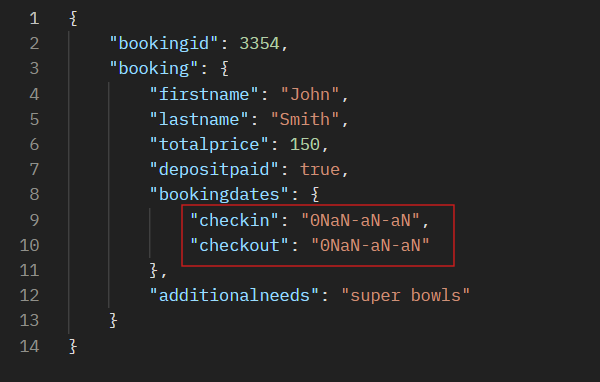

# 🧪 Restful Booker API Automation Tests.

## 📖 Descripción.

Este proyecto contiene una colección de **pruebas automatizadas de API** creadas en **Postman** para validar los endpoints de la API pública [Restful Booker](https://restful-booker.herokuapp.com/apidoc/index.html).

El objetivo es proporcionar una base para realizar **testing funcional y de integración** sobre la API, incluye flujos positivos y negativos para detectar errores y fallos.

## 📊 Alcance de la automatización

Esta automatización cubre los siguientes aspectos:

- Pruebas de autenticación (POST /auth).
- Creación de reservas (POST /booking).
- Consulta de reservas (GET /booking).
- Actualización de reservas (PUT/PATCH /booking).
- Eliminación de reservas (DELETE /booking).
- Validaciones de respuestas positivas y negativas.
- Manejo de variables de entorno.

## 🎓 Habilidades y conocimientos adquiridos

A través de este proyecto, se han adquirido conocimientos en:

- Diseño y ejecución de pruebas de API con Postman.
- Uso de entornos y variables en Postman.
- Automatización de pruebas con Newman.
- Integración continua con GitHub Actions.
- Generación de reportes de pruebas HTML con Newman-reporter-htmlextra.
- Mejores prácticas en testing de APIs.
- Deteccion de bugs a partir de pruebas automatizadas.


## 🗂️ Estructura del proyecto.

```
📦 RestfulBooker_API_Tests
│
├── 🧾 RestfulBooker_API_Testing.postman_collection.json   # Colección principal con todas las requests y documentación
├── 🌍 RestfulBooker_Env.postman_environment.json          # Entorno con variables (baseUrl, token, bookingId, etc.)
└── 📘 README.md                                           # Archivo de documentación del proyecto
```

## ⚙️ Como instalar este proyecto.

### 🪄 Prerrequisitos.

Antes de comenzar, asegúrate de tener instalado:

- [Postman](https://www.postman.com/downloads/).
- **Opcional:** [Node.js](https://nodejs.org/) (requerido para usar Newman).
- **Opcional:** [Newman](https://www.npmjs.com/package/newman) para ejecutar las pruebas desde la terminal.
- **Opcional:** [Newman-reporter-htmlextra](https://www.npmjs.com/package/newman-reporter-htmlextra) para generar un reporte html desde la terminal.

### 🚀 Instalación.

1. **Clona o descarga** este repositorio en tu máquina local.
   ```bash
   git clone https://github.com/RebeChiSan/restful_booker_API_tests.git
   ```
---

## 🧠 Como ejecutar este proyecto.

### 🧩 Desde Postman (GUI).

1. **Importa la colección** en Postman:
   - Abre Postman → *Import* → selecciona el archivo  
     `RestfulBooker_API_Testing.postman_collection.json`

2. **Importa el entorno**:
   - Abre Postman → *Environments* → *Import* → selecciona  
     `RestfulBooker_Env.postman_environment.json`

3. **Activa el entorno**:
   - En la esquina superior derecha de Postman, selecciona el entorno  
     `RestfulBooker_Env`.

4. **Run the collection**:

   **Opción 1**
   - Corre la colección completa manualmente. 

    1. **Generar token de autenticación**  
   Ejecuta la request `POST /auth` dentro del folder **1. Auth**. El `token` se almacenará automáticamente en la variable `{{token}}`.

    2. **Crear una reserva (POST /booking)**  
   Ejecuta la request dentro de **2. Booking - Create**. El `bookingId` se guarda automáticamente en la vairable `{{bookingId}}` para usarlo en las siguientes pruebas.

    3. **Consultar una reserva (GET /booking/{id})**  
   Usa el folder **3. Booking - Read** para validar datos creados.

    4. **Actualizar una reserva (PUT/PATCH)**  
   Modifica los datos de una reserva existente con las requests  de **4. Booking - Update**.

    5. **Eliminar una reserva (DELETE)**  
   Valida la eliminación de una reserva usando **5. Booking - Delete**.
    
   **Opción 2**
   - Corre la colección completa desde el **Collection Runner**. 

### 💻 Desde la terminal (usando Newman).

Si prefieres ejecutar todas las pruebas sin abrir Postman:

1. **Instala Newman** globalmente:
   ```bash
   npm install -g newman
   ```

2. **Instala Newman-reporter-htmlextra** globalmente:
   ```bash
   npm install -g newman-reporter-htmlextra
   ```

3. **Ejecuta la colección** con el siguiente comando desde el directorio raíz:
   ```bash
   newman run RestfulBooker_API_Testing.postman_collection.json -e RestfulBooker_Env.postman_environment.json --delay-request 500 --reporters cli,htmlextra
   ```
   Genera una carpeta llamada newman con el reporte HTML en el directorio raiz y muestra tambien los resultados en la terminal.

### 🐙 Desde GitHub Actions.

Este proyecto incluye un workflow de GitHub Actions que permite ejecutar las pruebas automáticamente en la nube, generando un reporte HTML.

1. **Navega a la pestaña Actions**:
   - Haz clic en la pestaña **Actions** en la parte superior del repositorio.

2. **Selecciona el workflow**:
   - Busca y selecciona el workflow llamado **"Postman Tests"**.

3. **Ejecuta el workflow**:
   - Haz clic en **"Run workflow"** (puedes seleccionar la rama si es necesario, por defecto es `main`).

4. **Descarga el reporte**:
   - Una vez completado el workflow, ve a la sección de **Artifacts** en el resumen del job y descarga el archivo `postman-html-report.zip` que contiene el reporte HTML de las pruebas.

### 🧰 Resultados.
Al ejecutar todas las pruebas sobre API, las cuales cubren tanto casos positivos como negativos, se detecto un relacionado con el status code de la respuesta recibida.

**Bug 01: Falta de validación de formato de fecha en creación de reserva**
ID: BUG-NEG03 
Severidad: Media 
Prioridad: Alta 
Endpoint: POST /booking

**Descripción**
La API permite la creación de recursos (o no notifica el error) cuando se envía un cuerpo de petición con formatos de fecha inválidos (ej. strings, enteros o caracteres especiales), devolviendo un código de estado 200 OK en lugar de un error de validación y una respuesta con la fecha de formato incorrecta.

**Pasos para reproducir**

1.- Uilizar la peticion NEG03 - Create Booking with Invalid Date Format

2.- En el JSON del body, enviar el campo de fecha con un valor no válido:

JSON

{
  "bookingdates": {
    "checkin": "fecha-invalida-123",
    "checkout": "hola mundo"
  }
}
3.- Ejecutar la peticion y observar la respuesta del servidor.

**Resultado Esperado**
El servidor debe devolver un 400 Bad Request o 4xx indicando que el formato de fecha es incorrecto.

**Resultado Actual**
El servidor devuelve un 200 OK.


**Nota: Al correr las pruebas con Github Actions estan van a fallar por esta razón.**

## 🧰 Tecnologías usadas.

| Tecnología | Descripción |
|-------------|-------------|
| **Postman** | Plataforma principal para ejecutar y documentar las pruebas de API. |
| **Newman**  | CLI para ejecutar colecciones de Postman en CI/CD o desde terminal. |
| **Node.js** | Entorno de ejecución para JavaScript, requerido para Newman. |
| **HTML Extra (Newman Reporter)** | Generador de reportes HTML detallados para las pruebas. |
| **JavaScript (Test Scripts)** | Usado en los tests de validación de respuesta y manejo de variables. |

---

📌 **Autor:** Rebeca C. Santiago  
💬 *Proyecto con fines de práctica en automatización de APIs.*